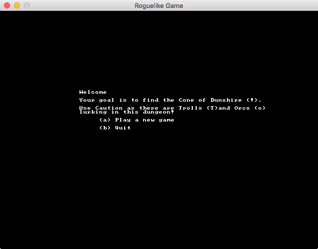
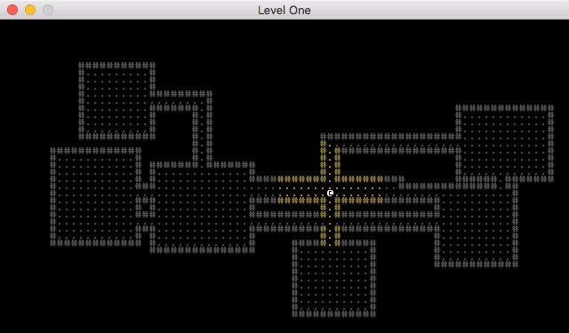

Getting Started
===============

.. contents::
    :local:

Before you begin it is important to understand what a Roguelike is.

.. pull-quote::
    Roguelike is a subgenre of role-playing video games characterized by a dungeon crawl through
    procedurally generated game levels, turn-based gameplay, tile-based graphics, and permanent
    death of the player-character.

    `<https://en.wikipedia.org/wiki/Roguelike>`_

That being said, Python-Roguelike-Framework will do all the heavy lifting and procedurally generate
your dungeon for you. All you need to do it define a few configuration settings which we will configure below.

Setup
-----

Before we dive in lets make sure you are ready to begin playing arund with the framework.

If you haven't done so yet, clone the `Python-Roguelike-Framework from the repo on github`_.

.. code-block:: bash

    git clone https://github.com/jpalladino84/Python-Roguelike-Framework

Once you have the framework downloaded you should install the requirements.

.. code-block:: bash

    pip install -r requirements.txt

You can test that everything is working by trying to run the game.

.. code-block:: bash

    ./run.py

If everything installed successfully you should see this screen.

Usage
-----

If you are new to Python or programming in general this is a good starting point for you. Even if you are an
experienced Pythonista I highly recommend reading this section to get a good grasp on what the framework can
do.

Python-Roguelike-Framework is meant to be easy to dive right in without having to touch a lot of code.

Each module in this project contains a config.py file. These are where you will define your dungeon and
what goes in it. In each config.py you will find a Python dictionary relevant to the module it lives within.

For instance, in the dungeon modules config.py you will define a level like so:

.. code-block:: python

    LEVELS = [{
        'id': 1,
        'name': 'Level One',
        'desc': None,
        'max_room_size': 14,
        'min_room_size': 10,
        'max_rooms': 10,
        'is_final_level': False,
        'items': [],
        'monsters': [
            ORC,
            ORC,
            TROLL
        ]
    }]
..

This will generate a dungeon that will look something like this:

Try playing around with the various configurations in each module. When you are ready move on to the tutorial.

.. _`Python-Roguelike-Framework from the repo on github`: https://github.com/jpalladino84/Python-Roguelike-Framework